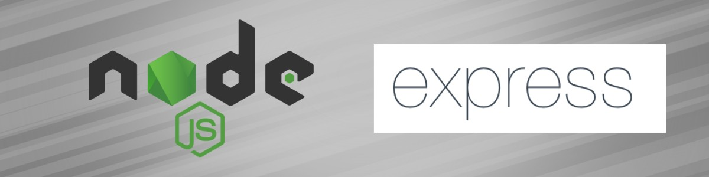
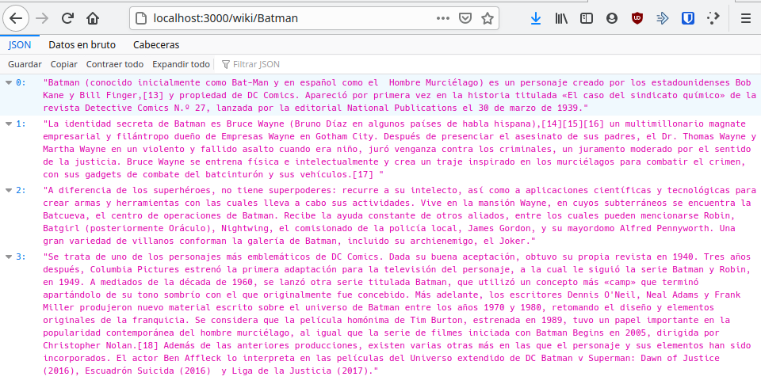

# Express

## ¿Qué es Express?

​	Express es un framework de Nodejs el cual posee unas características robustas que facilitan el desarrollo rápido de aplicaciones web. 

​	Este nos permite una escritura de manejadores de peticiones con diferentes verbos HTTP en diferentes caminos URL (rutas), establecer ajustes de aplicaciones web como qué puerto usar para  conectar, y la localización de las plantillas que se utilizan para  renderizar la respuesta, añadir procesamiento de peticiones "middleware" adicional en cualquier punto dentro de la tubería de manejo de la petición; entre otras características.

## Instalación

~~~bash
npm install express --save
~~~

## Comandos básicos

​	Su implementación es bastante simple, solo se necesita ingresar estas pequeñas líneas de código para hacerlo funcionar.

~~~javascript
const express = require('express');
const app = express():

app.listen(3000, () => console.log("Esuchando en el puerto 3000"));
~~~

​	Con estos simples pasos, ya es posible acceder a http://localhost:3000/ para observar la llamada.

## Ejemplo de uso

​	Con el código anterior, insertaremos una petición `GET` que nos permitirá conectarnos a Wikipedia para obtener una información de búsqueda.

1. Crear la petición `GET`.  

~~~javascript
app.get('/wiki/:name', (req, res) => {
	return res.json("Hello World")
});
~~~

​	Como se puede ver, la petición `GET` posee una cadena de texto que dice: `/wiki/:name`. Para poder acceder a esta, debemos ingresar a http://localhost/wiki/:name para poder visualizarlo.

2. Una vez lista, debemos instalar la librería de Wikipedia. para esto escribimos

~~~bash
npm install wikijs --save
~~~

3. Cuando la librería ya esté instalada, debemos conectarla con nuestro código. 

~~~javascript
const wiki = require('wikijs').default;
wiki({apiUrl: "https://es.wikipedia.org/w/api.php"})
        .page(name)
        .then(page => data = page.summary())
        .then(data => res.json(data.split("\n")[0]))
        .catch(err => res.json("Articulo no encontrado"));
~~~

4. Ahora que tenemos lista la implementación, solo nos queda unirla con la petición `GET`. Para esto tomamos el código que obtuvimos de la librería de WIkipedia y lo movemos dentro de `app.get`.

~~~javascript
const PORT = 3000;
const express = require('express');
const wiki = require('wikijs').default;
const app = express();
app.listen(PORT, () => {
    console.log(`Listen ${PORT} port`);
});
app.get('/wiki/:name', (req, res) => {
    let name = req.params.name;
    wiki({apiUrl: "https://es.wikipedia.org/w/api.php"})
        .page(name)
        .then(page => data = page.summary())
        .then(data => res.json(data.split("\n")))
        .catch(err => res.json("Articulo no encontrado"));
});
~~~

5. Con esto, ahora podemos entrar a nuestro link http://localhost/wiki/:name y reemplazar el `:name` por lo que queramos buscar, por ejemplo "Batman". Esto, nos da como resultado lo siguiente

​	Como se puede apreciar, la implementación de Express es bastante sencilla y rápida de realizar.

## Fuente

* https://developer.mozilla.org/es/docs/Learn/Server-side/Express_Nodejs/Introduction
* https://www.tutorialspoint.com/nodejs/nodejs_express_framework.htm

