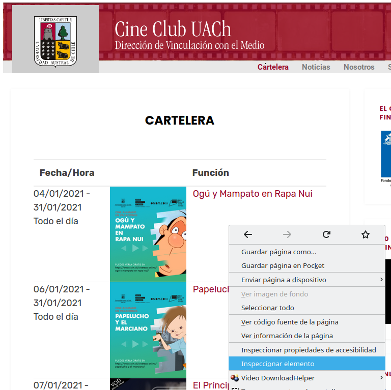
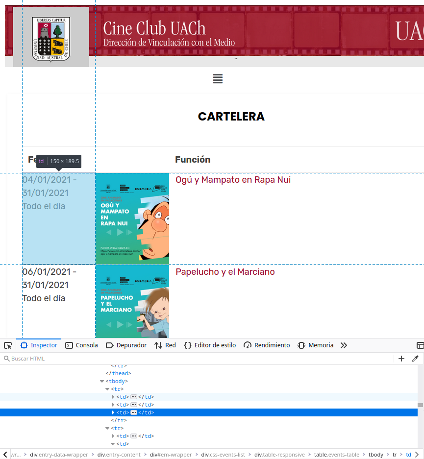
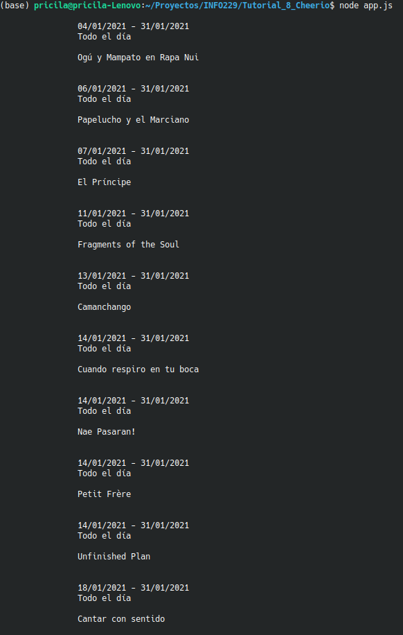
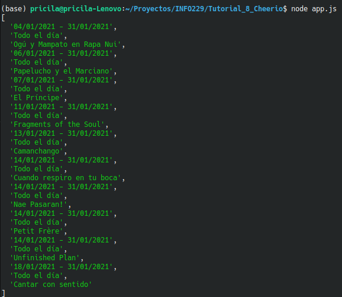
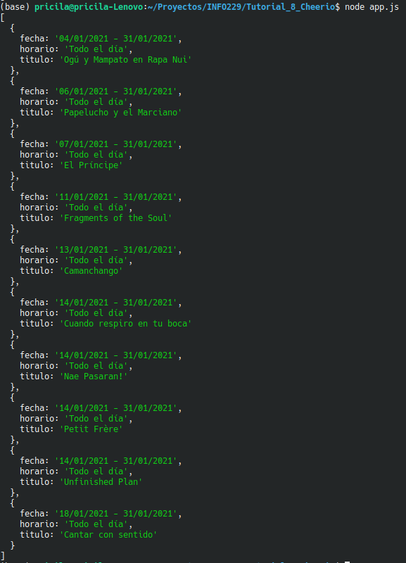

# Cheerio

## ¿Qué es Cheerio?

​	Cheerio es una librería Open Source que nos proporciona herramientas para extraer información relevante de internet.

## Instalación

~~~bash
npm install cheerio request --save
~~~

## Comandos básicos

​	En esta ocación, lo utilizaremos en conjunto con `request` para poder obtener el código HTML de una página web.

~~~javascript
const cheerio = require('cheerio');
const request = require('request');

const URL = 'URL de la página';

request(URL, (err, res, body) => {
    let $ = cheerio.load(body);
});
~~~

## Ejemplo de uso

​	A modo de ejemplo, extráeremos la cartelera de películas que se encuentran en la página web de Cine Club UACh (http://2020.cineclubuach.cl). 

1. Ingresamos a la página que queremos _scrapear_ e iniciamos el comando _Inspeccionar elemento_ para ver el código HTML.

1. Como se puede apreciar, la etiqueta que contiene la fecha, el horarío y el título de la película se encuentran dentro de la etiqueta `<td>` 

3. Ahora que conocemos la etiqueta, usaremos la ayuda de _Cheerio_ para obtener todo el texto que posea esta etiqueta.

~~~javascript
const cheerio = require('cheerio');
const request = require('request');

const URL = 'http://2020.cineclubuach.cl/';

request(URL, (err, res, body) => {
    let $ = cheerio.load(body);
    let text = $('td').text();
}
~~~

4. Con esto, lo que hacemos es obtener un String con todos los textos que estén dentro de las etiquetas `<td>`. Aún así, esto no es suficiente, ya que tenemos que quitarle los espacios y separarlos dependiendo de la información que nos de (fecha, título y horario).

5. Ahora lo que haremos será crear una función que tome toda esta información, la transforme a un arreglo y elimine todos los elementos vacíos.

~~~javascript
function filterData(array){
    data = [];
    array = array.split("\n");
    array.forEach(e => {
        if(e.trim().length > 0) data.push(e.trim());
    });
    return data;
}
~~~

6. Si hacemos con `console.log` podemos ver como nuestra información ya está tomando forma. Aún así nos falta indicar qué información nos da cada posición del arreglo

7. Ahora nos queda ordenar bien estos datos y separarlos en fecha, horario y título. Para esto crearemos una nueva función que tome los datos anteriores y los transforme a un nuevo arreglo de objetos. En el que cada objeto posea la información de la fecha, el horario y el título.

~~~javascript
function dataToArray(array){
    let k = 0;
    let data = [];
    for(let i = 0; i < array.length; i+=3){
        data[k] = {
            fecha: array[i],
            horario: array[i+1],
            titulo: array[i+2]
        }
        k++;
    }
    return data;
}
~~~

8. Con todo esto, ya tenemos el código listo.

~~~javascript
const cheerio = require('cheerio');
const request = require('request');

const URL = 'http://2020.cineclubuach.cl/';

request(URL, (err, res, body) => {
    let $ = cheerio.load(body);
    let text = $('td').text();
    text = filterData(text);
    text = dataToArray(text);
    console.log(text);
});

function filterData(array){
    data = [];
    array = array.split("\n");
    array.forEach(e => {
        if(e.trim().length > 0) data.push(e.trim());
    });
    return data;
}

function dataToArray(array){
    let k = 0;
    let data = [];
    for(let i = 0; i < array.length; i+=3){
        data[k] = {
            fecha: array[i],
            horario: array[i+1],
            titulo: array[i+2]
        }
        k++;
    }
    return data;
}
~~~

9. Resultado final

## Fuente

* https://www.youtube.com/watch?v=rcsvTUG0bs8
* https://dev.to/diass_le/tutorial-web-scraping-with-nodejs-and-cheerio-2jbh