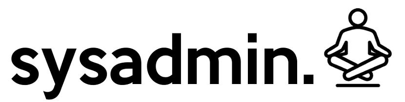

# Administrador de sistemas Linux

## ¿Qué es un administrador de sistemas Linux?

​	Un Administrador de sistemas Linux o también llamado _Sysadmin Linux_, es el encargado de administrar y gestionar los servidores GNU/Linux por consola.

## Comandos básicos

### `ls`: Permite listar archivos

~~~bash
$ ls
Descargas   Dropbox     Imágenes  Plantillas  Público
Documentos  Escritorio  Música    Proyectos   Vídeos
~~~

### `pwd`: Permite ver la ruta en la que nos encontramos

~~~bash
$ pwd
/home/esteban
~~~

### `cd`: Permite cambiar de directorio

~~~bash
$ cd Descargas
~~~

### `touch`: Permite crear un archivo vacío

~~~bash
$ touch example.txt
~~~

### `cat`: Permite mostrar el texto de un archivo en pantalla

~~~bash
$ cat expample.txt
Hello World!
~~~

### `mkdir`: Permite crear un directorio

~~~bash
$ mkdir carpeta1
~~~

### `mv`: Permite mover o renombrar ficheros o directorios

#### Mover

~~~bash
$ mv example.txt carpeta1/
~~~

#### Renombrar

~~~bash
$ mv example.txt expampleNewName.txt
~~~

### `rm`: Permite borrar ficheros o directorios

#### Borrar ficheros

~~~bash
$ rm example.txt
~~~

#### Borrar directorios

~~~bash
$ rm -fr carpeta1
~~~

### `man`: Permite ver el manual de un comando

~~~bash
$ man pwd
~~~

### `nano`: Abre un editor de texto en la consola

~~~bash
$ nano
~~~

## Ejemplo de uso

​	Con los comandos básicos ya dados, haremos lo siguiente: Crearemos una carpeta, la cual tendrá tres subcarpetas. En cada una de esas tres subcarpetas crearemos un archivo de texto vacío. En una de esos tres archivos de texto vacíos escribiremos la palabra "Hello World" con el editor de textos `nano` y luego la imprimiremos en pantalla con el comando `cat`.

1. Creamos un directorio principal

~~~bash
$ mkdir folder
~~~

2. Entramos al directorio ya creado

~~~bash
$ cd folder/
~~~

3. Dentro de este nuevo directorio, crearemos tres directorios más

~~~bash
$ mkdir folder1 folder2 folder3
~~~

4. Ahora que ya tenemos los tres directorios creados, nos toca crear un fichero a cada una

~~~bash
$ touch folder1/example1.txt folder2/example2.txt folder3/expample3.txt 
~~~

5. Una vez creados los tres ficheros vacíos, escribiremos "Hello World" en un fichero al azar. En este caso, será en `folder3/example3.txt`. Para esto, primero ingresaremos al directorio `folder3` para luego editar el fichero `example3.txt` con `nano`.

~~~bash
$ cd folder3/
$ nano example3.txt
~~~

6. Una vez escrito "Hello World", salimos con CTRL+X y luego la S y ENTER para guardar los cambios.
7. Ahora que ya tenemos el fichero con el texto, procedemos a imprimirlo en pantalla.

~~~bash
$ cat example3.txt
Hello World!
~~~

## Fuente

* https://www.youtube.com/watch?v=vC3rB56Q3kk
* https://www.youtube.com/watch?v=bju_FdCo42w&list=PLtK75qxsQaMLZSo7KL-PmiRarU7hrpnwK&index=1